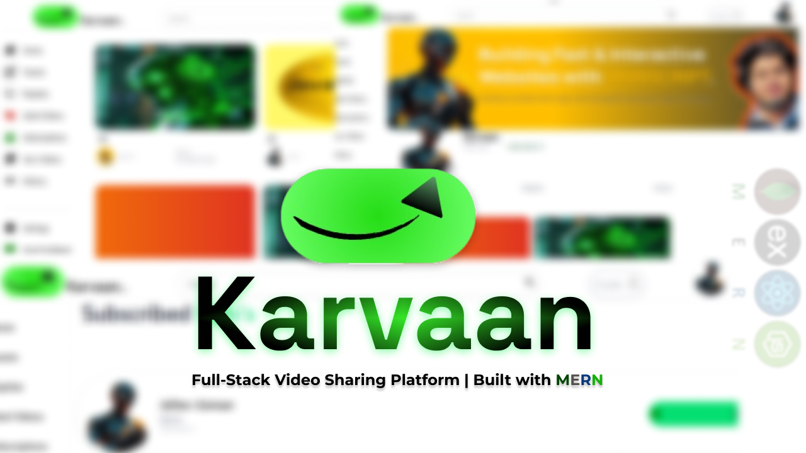

# Karvaan - A Full-Stack Video Sharing Platform

Karvaan is a full-stack video-sharing platform built using the **MERN stack (MongoDB, Express, React, Node.js)**. It allows users to create accounts, upload videos, create playlists, like/comment on videos, subscribe to other channels, and engage with content just like a modern video platform.



## 🚀 Features

### **User Features**
- User authentication with **JWT** (JSON Web Token)
- Upload and manage videos (stored in **Cloudinary**)
- Create and manage playlists
- Like, comment, and interact with videos
- Subscribe to other channels
- View other users' profiles
- Tweet updates

### **Tech Stack**
#### **Backend** (Node.js, Express, MongoDB, Cloudinary)
- **Node.js & Express.js** for server-side logic
- **MongoDB Atlas** for database storage
- **Cloudinary** for storing video uploads
- **JWT authentication** for secure login/logout
- **Mongoose** for database modeling

#### **Frontend** (React.js, React Icons)
- **React.js** for building the UI
- **React Router** for navigation
- **React Icons** for UI enhancements
- **Fully Responsive** design

## 📂 Project Setup

### **Clone the Repository**
```bash
git clone https://github.com/dipunjab/karvaan-App-MERN-
cd karvaan
```

### **Backend Setup**
1. Navigate to the backend folder:
   ```bash
   cd backend
   ```
2. Install dependencies:
   ```bash
   npm install
   ```
3. Create a `.env` file and configure:
   ```env
   PORT=8000
   MONGODB_URL=
   CORS_ORIGIN=https://karvaan-app-mern.vercel.app/
   ACCESS_TOKEN_SECRET=
   ACCESS_TOKEN_EXPIRY=1d
   REFRESH_TOKEN_SECRET=
   REFRESH_TOKEN_EXPIRY=10d

   CLOUDINARY_NAME=
   CLOUDINARY_API_KEY=
   CLOUDINARY_API_SERCRET=
   ```
4. Start the server:
   ```bash
   npm run dev
   ```

### **Frontend Setup**
1. Navigate to the frontend folder:
   ```bash
   cd ../frontend
   ```
2. Install dependencies:
   ```bash
   npm install
   ```
3. Start the React development server:
   ```bash
   npm run dev
   ```

## 🌐 Deployment
- **Backend deployed on Vercel**
- **Frontend deployed on Vercel**
- **MongoDB hosted on MongoDB Atlas**
- **Videos stored in Cloudinary**

## ❗ Note on Video Uploads
Currently, due to **Vercel’s 4.5MB request limit**, videos must be **under 4.5MB**. A proper solution for handling larger files is in progress.

## 📜 License
This project is open-source and available under the **MIT License**.

---
### 🎥 Live Demo & Repository Links
📌 **Live App**: [Vercel Deployment Link](https://karvaan-app-mern.vercel.app/)  
📌 **GitHub Repository**: [GitHub Link](https://github.com/dipunjab/karvaan-App-MERN-)

---
Feel free to contribute or share your thoughts! 🚀

